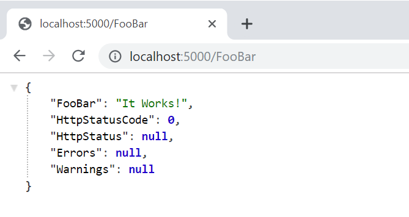

# Quick Start with GoodREST
## Create Project
### Introduction
As you probably know , for building project you need basic computer skills and some knowledge about .net framework , c# programming language and your favourite IDE.
Mine goal is to show you fastes way of building Web API with GoodREST library.
You have two path:
### VS Code and command line/powershell
1. Open command line/power shell
2. Create directory in your workspace for Web API project `mkdir Contoso.Foo.WebApi`
2. Navigate to newly created project `cd Contoso.Foo.WebApi`
4. Create Empty ASP .Net Web api project based on provided templates `dotnet new web`
5. Install required packages `dotnet add package goodREST` and `dotnet add package goodREST.Middleware`
6. open your favorite IDE by executing following command `code .`

### Visual Studio 
1. Create New Empty WebProject from menu
2. Add goodRest Packages from package manager

## Add REST API objects
### Creating Message Objects for handling request and response
Create folder with name `Messages` under your project. and add two classes, one for Request `GetBar.cs` and for response `GetBarResponse.cs`

Modify `GetBar.cs` which following code:

```
using GoodREST.Annotations;
using GoodREST.Enums;
using GoodREST.Interfaces;

namespace Contoso.Foo.WebApi.Messages
{
    [Route("/FooBar", HttpVerb.GET)]
    public class GetBar : IHasResponse<GetBarResponse>
    {

    }
}
```

4. Modify `GetBarResponse.cs` with following code:
```
using System.Collections.Generic;
using GoodREST.Interfaces;

namespace Contoso.Foo.WebApi.Messages
{
    public class GetBarResponse : IResponse
    {
        public string FooBar { get; set; }
        public int HttpStatusCode { set; get; }
        public string HttpStatus { set; get; }
        public ICollection<string> Errors { set; get; }
        public ICollection<string> Warnings { set; get; }
    }
}
```
By this you're good with service message models which will be handled by service class:

### Building service class which will handle request and response.
Create service class `BarService.cs` under `Services` folder which will handle business logic and should look following:
```
using System;
using Contoso.Foo.WebApi.Messages;
using GoodREST.Extensions;
using GoodREST.Middleware.Services;

namespace Contoso.Foo.WebApi.Services
{
    public class BarService : ServiceBase
    {
        public GetBarResponse Get(GetBar request)
        {
            var response = new GetBarResponse();
            try
            {
                response.FooBar = "It Works!";
            }
            catch (Exception ex)
            {
                response.ConvertExceptionAsError(ex, 500);
            }
            return response;
        }
    }
}
```
### Register dependencies and add GoodREST middleware to your asp.net core app
Register all required call's under `Startup.cs` so your file should look similar to 
```
using System;
using System.Collections.Generic;
using System.Linq;
using System.Threading.Tasks;
using Contoso.Foo.WebApi.Messages;
using Contoso.Foo.WebApi.Services;
using GoodREST.Interfaces;
using GoodREST.Middleware;
using GoodREST.Middleware.Services;
using Microsoft.AspNetCore.Builder;
using Microsoft.AspNetCore.Hosting;
using Microsoft.AspNetCore.Http;
using Microsoft.Extensions.DependencyInjection;

namespace Contoso.Foo.WebApi
{
    public class Startup
    {
        public void ConfigureServices(IServiceCollection services)
        {
            services.AddRouting();
            services.AddGoodRest(x =>
            {
                x.CharacterEncoding = "utf-8";
            });
            services.AddTransient<IRequestResponseSerializer, GoodREST.Serializers.JsonSerializer>();
            services.AddTransient<ServiceBase, BarService>();
        }

        public void Configure(IApplicationBuilder app, IHostingEnvironment env)
        {
            if (env.IsDevelopment())
            {
                app.UseDeveloperExceptionPage();
            }

            app.TakeGoodRest(configure =>
            {
                configure.RegisterMessageModel<GetBar>();
            });
        }
    }
}
```
## Run project 
Basically if youre command line user and you like shell just type `dotnet run` , you should see similar message:
```
Hosting environment: Development
Content root path: D:\WORK\GoodREST.IO\example\QuickStart\Contoso.Foo.WebApi
Now listening on: https://localhost:5001
Now listening on: http://localhost:5000
Application started. Press Ctrl+C to shut down.
```
by this you know that you're app is listetning on port `5000` for `HTTP` and `5001` for `HTTPS`

7. open you're favorite web browser and navigate to `http://localhost:{yourport}/FooBar`
You should get something like this:


## Working Example
Working example of application you can find in repository under `example\QuickStart\Contoso.Foo.WebApi`


## This was just quickstart example
For getting information about library itself and design principles of message-based api concept, please see [Architecture](../Architecture/index.md) page.
You will be able to find there more information about concepts, why its good to orchestrate your code such way. And you learn all benefits from building your app such way.
